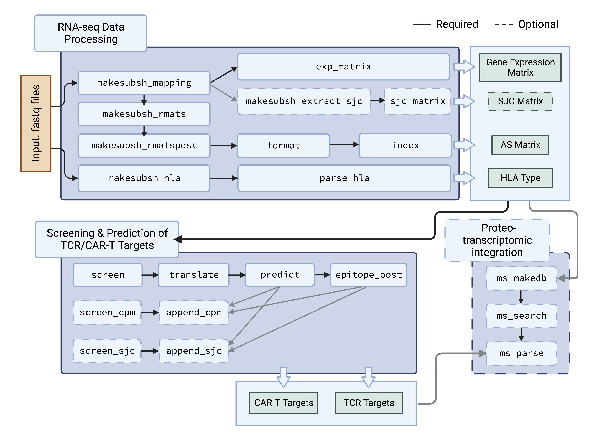

# IRIS: Isoform peptides from RNA splicing for Immunotherapy target Screening


## Quick guide

* [Dependencies](#dependencies)
* [Installation](#installation)
* [Usage](#usage)
  + [Usage - individual functions (for customized pipelines)](#individual-functions)
  + [Usage - streamlined major functions (for common use)](#streamlined-functions-of-major-modules)
  + [Snakemake](#snakemake)
* [Example](#example)
* [Output](#example-output)
* [Contact](#contact)
* [Publication](#publication)

## Dependencies

### Core dependencies (required for major IRIS functions/steps - format, screen, and predict)

* python 2.7.x (numpy, scipy, seaborn, pyBigWig, statsmodels, pysam)
* [IEDB stand-alone](http://tools.iedb.org/main/download/) (Note: IRIS is only tested on 20130222 [2.15.5](https://downloads.iedb.org/tools/mhci/2.15.5/))
  + IEDB additionally depends on:
    - [tcsh](http://www.tcsh.org)
    - [gawk](http://www.gnu.org/software/gawk/)
* [bedtools 2.29.0](https://bedtools.readthedocs.io/en/latest/)

### Other dependencies (required for processing raw RNA-Seq and MS data)

* [STAR 2.5.3](https://github.com/alexdobin/STAR/releases/tag/2.5.3a): required for IRIS RNA-seq processing
* [samtools 1.3](https://sourceforge.net/projects/samtools/files/samtools/): required for IRIS RNA-seq processing
* [rMATS-turbo](https://github.com/Xinglab/rmats-turbo): required for IRIS RNA-seq processing
* [Cufflinks 2.2.1](http://cole-trapnell-lab.github.io/cufflinks/install/): required for IRIS RNA-seq processing
* [seq2HLA](https://github.com/TRON-Bioinformatics/seq2HLA): required for HLA typing (Note: The [original URL](https://bitbucket.org/sebastian_boegel/seq2hla/src/default/) of the tool is no longer working); requires [bowtie](http://bowtie-bio.sourceforge.net/index.shtml)
* [MS GF+ (v2018.07.17)](https://github.com/MSGFPlus/msgfplus): required for MS search; requiring [Java](https://www.java.com/en/download/)
* [R](https://www.r-project.org/): used by seq2HLA

## Installation

### 1. Download

#### 1.1 Download IRIS program

The IRIS program can be downloaded directly from the repository, as shown below:
```
git clone https://github.com/Xinglab/IRIS.git
cd IRIS
```
__IRIS is designed to make use of a computing cluster to improve performance. For users who want to enable cluster execution for functions that support it (see [Configure](#3-configure-for-compute-cluster) for details), please update the contents of [snakemake_profile/](snakemake_profile/) to ensure compatibility with the available compute environment.__

#### 1.2 Download IRIS db

IRIS loads a big-data reference database of splicing events and other genomic annotations. These data are included in [IRIS_data.v2.0.0](https://drive.google.com/drive/folders/1zhmXoajD5RyjxVTYbGZ-ebic1VPfEYKz?usp=sharing) (a Google Drive link; size of entire folder is ~400 GB; users can select reference groups to download). The files need to be placed under `./IRIS_data/`

The files can be automatically downloaded with [google_drive_download.py](google_drive_download.py). Downloading a large amount of data with the API requires authentication:
* https://cloud.google.com/docs/authentication/production
* https://cloud.google.com/bigquery/docs/authentication/service-account-file

To use the script, first create a service account:
* Go to google cloud console -> IAM & Admin -> Service Accounts -> create service account
* Give the new account: role=owner
* Click the new service account email on the service account page
* Download a .json key by clicking: keys -> add key -> create new key -> json

That .json key is passed to [google_drive_download.py](google_drive_download.py)

#### 1.3 Download IEDB MHC I prediction tools

Download `IEDB_MHC_I-2.15.5.tar.gz` from the IEDB website (see [Dependencies](#dependencies)). Create a folder named `IEDB/` in the IRIS folder, then move the downloaded gz file to `IEDB/`. From http://tools.iedb.org/main/download/
* click "MHC Class I"
* click "previous version"
* find and download version 2.15.5

The manual download is needed because there is a license that must be accepted.

### 2. Install

[./install](./install) can automatically install most dependencies to conda environments:
* conda must already be installed for the script to work
  + https://docs.conda.io/en/latest/miniconda.html
* The install script will check if `IRIS_data/` has been downloaded
  + To download see [1.2 Download IRIS db](#12-download-iris-db)
* The install script will check if IEDB tools has been downloaded
  + To download see [1.3 Download IEDB MHC I prediction tools](#13-download-iedb-mhc-i-prediction-tools)

Under the IRIS folder, to install IRIS [core dependencies](#core-dependencies-required-for-major-iris-functionssteps---format-screen-and-predict), do:
```
./install core
```

To install [optional dependencies](#other-dependencies-required-for-processing-raw-rna-seq-and-ms-data) not needed for the most common IRIS usage:
```
./install all
```

### 3. Configure for compute cluster

[Snakefile](Snakefile) describes the IRIS pipeline. The configuration for running jobs can be set by editing [snakemake_profile/](snakemake_profile/). The provided configuration adapts IRIS to use Slurm. Other compute environments can be supported by updating this directory
* [snakemake_profile/config.yaml](snakemake_profile/config.yaml): Sets various Snakemake parameters including whether to submit jobs to a cluster.
* [snakemake_profile/cluster_submit.py](snakemake_profile/cluster_submit.py): Script to submit jobs.
* [snakemake_profile/cluster_status.py](snakemake_profile/cluster_status.py): Script to check job status.
* [snakemake_profile/cluster_commands.py](snakemake_profile/cluster_commands.py): Commands specific to the cluster management system being used. The default implementation is for Slurm. Other cluster environments can be used by changing this file. For example, [snakemake_profile/cluster_commands_sge.py](snakemake_profile/cluster_commands_sge.py) can be used to overwrite `cluster_commands.py` to support an SGE cluster.
* To force Snakemake to execute on the local machine modify [snakemake_profile/config.yaml](snakemake_profile/config.yaml):
  + comment out `cluster`
  + set `jobs: {local cores to use}`
  + uncomment the `resources` section and set `mem_mb: {MB of RAM to use}`

### 4. Known issues

* The conda install of Python 2 may give an error like `ImportError: No module named _sysconfigdata_x86_64_conda_linux_gnu`
  + Check for the error by activating `conda_env_2` and running `python`
  + Resolve with commands similar to
    - `cd conda_env_2/lib/python2.7/`
    - `cp _sysconfigdata_x86_64_conda_cos6_linux_gnu.py _sysconfigdata_x86_64_conda_linux_gnu.py`
* IRIS uses `--label-string` to determine which fastq files are for read 1 and read 2
  + To avoid any issues name your fastq files so that they end with `1.fastq` and `2.fastq` to indicate which file represents which pair of the read

## Usage

* For streamlined AS-derived target discovery, please follow [major functions](#streamlined-functions-of-major-modules) and run the corresponding toy example.
* For customized pipeline development, please check [all functions](#individual-functions) of IRIS.


This flowchart shows how the IRIS functions are organized



### Individual functions

IRIS provides individual functions/steps, allowing users to build pipelines for their customized needs. [IRIS_functions.md](IRIS_functions.md) describes each model/step, including RNA-seq preprocessing, HLA typing, proteo-transcriptomic MS searching, visualization, etc.
```
usage: IRIS [-h] [--version]

positional arguments:
  {format,screen,predict,epitope_post,process_rnaseq,makesubsh_mapping,makesubsh_rmats,makesubsh_rmatspost,exp_matrix,makesubsh_extract_sjc,extract_sjc,sjc_matrix,index,translate,pep2epitope,screen_plot,screen_sjc,append_sjc,annotate_ijc,screen_cpm,append_cpm,screen_novelss,screen_sjc_plot,makesubsh_hla,parse_hla,ms_makedb,ms_search,ms_parse,visual_summary}
    format              Format AS matrices from rMATS, followed by indexing
                        for IRIS
    screen              Identify AS events of varying degrees of tumor
                        association and specificity using an AS reference
                        panel
    predict             Predict and annotate AS-derived TCR (pre-prediction)
                        and CAR-T targets
    epitope_post        Post-prediction step to summarize predicted TCR
                        targets
    process_rnaseq      Process RNA-Seq FASTQ files to quantify gene
                        expression and AS
    makesubsh_mapping   Make submission shell scripts for running
                        'process_rnaseq'
    makesubsh_rmats     Makes submission shell scripts for running rMATS-turbo
                        'prep' step
    makesubsh_rmatspost
                        Make submission shell scripts for running rMATS-turbo
                        'post' step
    exp_matrix          Make a merged gene expression matrix from multiple
                        cufflinks results
    makesubsh_extract_sjc
                        Make submission shell scripts for running
                        'extract_sjc'
    extract_sjc         Extract SJ counts from STAR-aligned BAM file and
                        annotates SJs with number of uniquely mapped reads
                        that support the splice junction.
    sjc_matrix          Make SJ count matrix by merging SJ count files from a
                        specified list of samples. Performs indexing of the
                        merged file
    index               Index AS matrices for IRIS
    translate           Translate AS junctions into junction peptides
    pep2epitope         Wrapper to run IEDB for peptide-HLA binding prediction
    screen_plot         Make stacked/individual violin plots for list of AS
                        events
    screen_sjc          Identify AS events of varying degrees of tumor
                        specificity by comparing the presense-absense of
                        splice junctions using a reference of SJ counts
    append_sjc          Append "screen_sjc" result as an annotation to PSI-
                        based screening results and epitope prediction results
                        in a specified screening output folder
    annotate_ijc        Annotate inclusion junction count info to PSI-based
                        screening results or epitope prediction results in a
                        specified screening output folder. Can be called from
                        append_sjc to save time
    screen_cpm          Identify AS events of varying degrees of tumor
                        association and specificity using an AS reference
                        panel based on normalized splice junction read counts
    append_cpm          Append "screen_cpm" result as an annotation to PSI-
                        based screening results and epitope prediction results
                        in a specified screening output folder
    screen_novelss      Identify AS events of varying degrees of tumor
                        association and specificity, including events with
                        unannotated splice junctions deteced by rMATS
                        "novelss" option
    screen_sjc_plot     Make stacked/individual barplots of percentage of
                        samples expressing a splice junction for list of AS
                        events
    makesubsh_hla       Make submission shell scripts for running seq2HLA for
                        HLA typing using RNA-Seq
    parse_hla           Summarize seq2HLA results of all input samples into
                        matrices for IRIS use
    ms_makedb           Generate proteo-transcriptomic database for MS search
    ms_search           Wrapper to run MSGF+ for MS search
    ms_parse            Parse MS search results to generate tables of
                        identified peptides
    visual_summary      Make a graphic summary of IRIS results

optional arguments:
  -h, --help            show this help message and exit
  --version             show program's version number and exit

For command line options of each sub-command, type: IRIS COMMAND -h
```

### Streamlined functions of major modules

The core of IRIS immunotherapy target discovery comprises of four steps from three major modules. For a quick test, see [Example](#example) which uses the snakemake to run a small data set.
* **Step 1**. Generate and index PSI-based AS matrix from rMATS output (RNA-seq data processing module)
  + `IRIS format` option `-d` should be used to save the generated PSI-based AS matrix to the downloaded IRIS DB.
  + Example files for `rmats_mat_path_manifest` and `rmats_sample_order` can be found under the 'example' folder for the test run.
  + `IRIS index` will create an index for the IRIS format generated PSI-based AS matrix, and `-o` should be the path to the folder containing the generated AS matrix.
  + The option `novelSS` is experimental and not fully validated. It takes the output from the experimental function in rMATS to identify events with unannotated splice sites. Please refer to the latest rMATS (> v4.0.0) for details.
```
usage: IRIS format [-h] -t {SE,RI,A3SS,A5SS} -n DATA_NAME -s {1,2}
                   [-c COV_CUTOFF] [-i] [-e] [-d IRIS_DB_PATH] [--novelSS]
                   [--gtf GTF]
                   rmats_mat_path_manifest rmats_sample_order

usage: IRIS index [-h] -t {SE,RI,A3SS,A5SS} -n DATA_NAME
                  [-c COV_CUTOFF] [-o OUTDIR]
                  splicing_matrix
```

* **Step 2**. Screen and translate tumor-associated events (IRIS screening module: 'tumor-association screen' + optional 'tumor-recurrence screen')
  + Description of the `PARAMETER_FIN` input file can be found at [example/parameter_file_description.txt](example/parameter_file_description.txt), and an example file can be found at [example/NEPC_test.para](example/NEPC_test.para).
  +  To perform an optional tumor-recurrence screen, include a 'tumor reference' in the `PARAMETER_FIN` input file.
  +  Users can also use an optional secondary tumor-association screen (not included in Snakemake) by calling `IRIS screen_cpm`. This screening test accounts for the joint effects of overall gene expression and AS. Commands to run this test and the output result format are similar to tumor-specificity test in the __'Step 4'__ below.
  +  Option `-t` in `IRIS screen` runs `IRIS translate` to generate SJ peptides, a required step for IRIS module for target prediction.
```
usage: IRIS screen [-h] -p PARAMETER_FIN
                   --splicing-event-type {SE,RI,A3SS,A5SS} -o OUTDIR [-t]
                   [-g GTF] [--all-reading-frames] [--ignore-annotation]
                   [--remove-early-stop] [--min-sample-count MIN_SAMPLE_COUNT]
                   [--use-existing-test-result]
                   
usage: IRIS translate  [-h] -g REF_GENOME
                       --splicing-event-type {SE,RI,A3SS,A5SS} --gtf GTF
                       -o OUTDIR [--all-orf] [--ignore-annotation]
                       [--remove-early-stop] [-c DELTAPSI_COLUMN] [-d DELTAPSI_CUT_OFF]
                       [--no-tumor-form-selection] [--check-novel]
                       as_input             
```

* **Step 3**. Predict both extracellular targets and epitopes(__designed for cluster execution__) (IRIS target prediction module)
  + `IRIS predict` can generate CAR-T annotation results and prepare a job array submission for TCR epitope prediction. TCR prediction preparation is optional and can be disabled by using `--extraceullular-only`.
  + `IRIS epitope_post` will summarize TCR epitope prediction results after TCR epitope prediction jobs from IRIS predict are submitted and finished (job array submission step can be done manually or using snakemake)
  + `MHC_LIST` and `MHC_BY_SAMPLE` can be generated by running `HLA_typing` (within or outside of IRIS). Note that it is not necessary to restrict HLA types detected from input RNA samples. It is recommended for users to specify dummy files only containing HLA types of interest or common HLA types as long as HLA types in the dummy `hla_types.list` and `hla_patient.tsv` are consistent. Example files for `hla_types.list` and `hla_patient.tsv` can be found at [example/hla_types_test.list](example/hla_types_test.list) and [example/hla_patient_test.tsv](example/hla_patient_test.tsv) respectively.
```
usage: IRIS predict [-h] --task-dir TASK_DIR -p PARAMETER_FIN
                    -t {SE,RI,A3SS,A5SS} [--iedb-local IEDB_LOCAL]
                    [-m MHC_LIST] [--extracellular-only] [--tier3-only]
                    [--gene-exp-matrix GENE_EXP_MATRIX] [-c DELTAPSI_COLUMN]
                    [-d DELTAPSI_CUT_OFF] [-e EPITOPE_LEN_LIST] [--all-reading-frames]
                    [--extracellular-anno-by-junction]
                    IRIS_screening_result_path

usage: IRIS epitope_post [-h] -p PARAMETER_FIN -o OUTDIR
                         -t {SE,RI,A3SS,A5SS} -m MHC_BY_SAMPLE
                         -e GENE_EXP_MATRIX [--tier3-only] [--keep-exist]
                         [--epitope-len-list EPITOPE_LEN_LIST]
                         [--no-match-to-canonical-proteome]
                         [--no-uniqueness-annotation]
                         [--ic50-cut-off IC50_CUT_OFF]
```

* **Step 4**. Perform tumor-specificity screen, a more strigent screen comparing the presence-absence of a given SJ between tumor and normal tissues (IRIS screening module: 'tumor-specificity screen')
  + `IRIS append_sjc` combines `screen` and `screen_sjc` results (by appending `screen_sjc` outputs to `screen` outputs). This 'integrated' output contains annotations for tumor-specific targets.
  + `IRIS append_sjc -i` option can be used to execute both `IRIS append_sjc` and `IRIS annotate_ijc` functions. If `-i` option is used, `-p` and `-e` arguments are required.
```
usage: IRIS screen_sjc [-h] -p PARAMETER_FIN
                       --splicing-event-type {SE,RI,A3SS,A5SS}
                       -e EVENT_LIST_FILE -o OUTDIR
                       [--use-existing-test-result]
                       [--tumor-read-cov-cutoff TUMOR_READ_COV_CUTOFF]
                       [--normal-read-cov-cutoff NORMAL_READ_COV_CUTOFF]

usage: IRIS append_sjc [-h] --sjc-summary SJC_SUMMARY
                       --splicing-event-type {SE,RI,A3SS,A5SS} -o OUTDIR
                       [-i] [-u] [-p PARAMETER_FILE]
                       [-e SCREENING_RESULT_EVENT_LIST]
                       [--inc-read-cov-cutoff INC_READ_COV_CUTOFF]
                       [--event-read-cov-cutoff EVENT_READ_COV_CUTOFF]

usage: IRIS annotate_ijc [-h] -p PARAMETER_FILE
                         --splicing-event-type {SE,RI,A3SS,A5SS}
                         -e SCREENING_RESULT_EVENT_LIST -o OUTDIR
                         [--inc-read-cov-cutoff INC_READ_COV_CUTOFF]
                         [--event-read-cov-cutoff EVENT_READ_COV_CUTOFF]

```


### Snakemake

The Snakemake workflow can be run with [./run](./run). First set the configuration values in [snakemake_config.yaml](snakemake_config.yaml):
* Set the resources to allocate for each job:
  + `{job_name}_{threads}`
  + `{job_name}_{mem_gb}`
  + `{job_name}_{time_hr}`
* Set the reference files:
  + Provide the file names for `gtf_name:` and `fasta_name:`
  + Either place the files in `./references/` or provide a URL under `reference_files:` to download the (potentially gzipped) files:
```
gtf_name: 'some_filename.gtf'
fasta_name: 'other_filename.fasta'
reference_files:
  some_filename.gtf.gz:
    url: 'protocol://url/for/some_filename.gtf.gz'
  other_filename.fasta.gz:
    url: 'protocol://url/for/other_filename.fasta.gz'
```
* Set the input files:
  + `sample_fastqs:` Set the read 1 and read 2 fastq files for each sample. For example:
```
sample_fastqs:
  sample_name_1:
    - '/path/to/sample_1_read_1.fq'
    - '/path/to/sample_1_read_2.fq'
  sample_name_2:
    - '/path/to/sample_2_read_1.fq'
    - '/path/to/sample_2_read_2.fq'
```
  + `blocklist`: an optional blocklist of AS events similar to [IRIS/data/blocklist.brain_2020.txt](IRIS/data/blocklist.brain_2020.txt)
  + `mapability_bigwig`: an optional file for evaluating splice region mappability similar to `IRIS_data/resources/mappability/wgEncodeCrgMapabilityAlign24mer.bigWig`
  + `mhc_list`: required if not starting with fastq files, similar to [example/hla_types_test.list](example/hla_types_test.list)
  + `mhc_by_sample`: required if not starting with fastq files, similar to [example/hla_patient_test.tsv](example/hla_patient_test.tsv)
  + `gene_exp_matrix`: optional tsv file with geneName as the first column and the expression for each sample in the remaining columns
  + `splice_matrix_txt`: optional output file from IRIS index that can be used as a starting point
  + `splice_matrix_idx`: the index file for `splice_matrix_txt`
  + `sjc_count_txt`: optional output file from `IRIS sjc_matrix` that can be used as a starting point. Only relevant if `should_run_sjc_steps`
  + `sjc_count_idx`: the index file for `sjc_count_txt`
* Set other options
  + `run_core_modules`: set to `true` to start with existing `IRIS format` output and HLA lists
  + `run_all_modules`: set to `true` to start with fastq files
  + `should_run_sjc_steps`: set to `true` to enable splice junction based evaluation steps
  + `star_sjdb_overhang`: used by STAR alignment. Should ideally be `read_length -1`, but the STAR manual says that 100 works well as a default
  + `run_name`: used to name output files that will be written to `IRIS_data/`
  + `splice_event_type`: one of `[SE, RI, A3SS, A5SS]`
  + `comparison_mode`: one of `[group, individual]`
  + `stat_test_type`: one of `[parametric, nonparametric]`
  + `use_ratio`: set to `true` to require a ratio of reference groups to pass the checks rather than a fixed count
  + `tissue_matched_normal_..._{cutoff}`: set cutoffs for the tissue matched normal reference group (tier 1)
  + `tissue_matched_normal_reference_group_names`: a comma separated list of directory names under `IRIS_data/db`
  + `tumor_..._{cutoff}`: set cutoffs for the tumor reference group (tier 2)
  + `tumor_reference_group_names`: a comma separated list of directory names under `IRIS_data/db`
  + `normal_..._{cutoff}`: set cutoffs for the normal reference group (tier 3)
  + `normal_reference_group_names`: a comma separated list of directory names under `IRIS_data/db`

## Example

The snakemake is configured to run the above [IRIS streamlined major functions](#streamlined-functions-of-major-modules) using [example/](example/). For customized pipeline development, we recommend that users refer to the [Snakefile](Snakefile) as a reference. [Snakefile](Snakefile) defines the steps of the pipeline. To run the example, update the `/path/to/` values with full paths in [snakemake_config.yaml](snakemake_config.yaml), and make any adjustments to [snakemake_profile/](snakemake_profile/). Then
```
./run
```
__As mentioned in [Usage](#usage), the full example is designed to be run with a compute cluster.__ It will take < 5 min for the formatting and screening steps and usually < 15 min for the prediction step (depending on available cluster resources).


A successful test run will generate the following result files in `./results/NEPC_test/screen/` (row numbers are displayed before each file name):
```
    0 NEPC_test.SE.notest.txt
    1 NEPC_test.SE.test.all_guided.txt
    1 NEPC_test.SE.tier1.txt
    1 NEPC_test.SE.tier1.txt.integratedSJC.txt
    4 NEPC_test.SE.tier2tier3.txt.ExtraCellularAS.txt
    4 NEPC_test.SE.tier2tier3.txt.ExtraCellularAS.txt.integratedSJC.txt
    6 NEPC_test.SE.tier2tier3.txt
    6 NEPC_test.SE.tier2tier3.txt.ijc_info.txt
    6 NEPC_test.SE.tier2tier3.txt.integratedSJC.txt
   11 NEPC_test.SE.test.all_voted.txt
    4 SE.tier2tier3/epitope_summary.junction-based.txt
    4 SE.tier2tier3/epitope_summary.junction-based.txt.integratedSJC.txt
    9 SE.tier2tier3/epitope_summary.peptide-based.txt
    9 SE.tier2tier3/epitope_summary.peptide-based.txt.integratedSJC.txt
   11 SE.tier2tier3/pred_filtered.score500.txt
```
A summary graphic is generated to `./results/NEPC_test/visualization/summary.png`

## Example output

Final reports are shown in __bold__ font.

### Default screen (tumor-associated screen) results

`[TASK/DATA_NAME].[AS_TYPE].test.all_guided.txt`: All AS events tested by IRIS screening with tissue-matched normal tissue reference panel available. One-sided test will be used to generate p-value.

`[TASK/DATA_NAME].[AS_TYPE].test.all_voted.txt`: All AS events tested by IRIS screening without tissue-matched normal tissue reference panel. Two-sided test will be used to generate p-value for comparisons to normal panels.

`[TASK/DATA_NAME].[AS_TYPE].notest.txt`: During screening, AS events skipped due to no variance or no available comparisons

`[TASK/DATA_NAME].[AS_TYPE].tier1.txt`: Tumor-associated AS events after comparison to tissue-matched normal panel ('tier1' events)

`[TASK/DATA_NAME].[AS_TYPE].tier2tier3.txt`: Tumor-associated AS events after comparison to tissue-matched normal panel, tumor panel, and normal tissue panel ('tier3' AS events)

### CAR-T annotation reports

__`[TASK/DATA_NAME].[AS_TYPE].tier1.txt.ExtraCellularAS.txt`__: Tumor-associated AS events in 'tier1' set that are associated with protein extracellular annotation and may be used for CAR-T targets

__`[TASK/DATA_NAME].[AS_TYPE].tier2tier3.txt.ExtraCellularAS.txt`__: Tumor-associated AS events in 'tier3' set that are associated with protein extracellular annotation and may be used for CAR-T targets

### TCR prediction reports

`[AS_TYPE].tier1/pred_filtered.score500.txt`: IEDB prediction outputs for SJ peptides from 'tier1' set with HLA-peptide binding IC50 values passing user-defined cut-off

__`[AS_TYPE].tier1/epitope_summary.peptide-based.txt`__: AS-derived epitopes from 'tier1' set that are predicted to bind user-defined HLA types

__`[AS_TYPE].tier1/epitope_summary.junction-based.txt`__: AS events from 'tier1' set that are predicted to bind user-defined HLA types

`[AS_TYPE].tier2tier3/pred_filtered.score500.txt`: IEDB prediction outputs for AS junction peptides from 'tier3' set with HLA-peptide binding IC50 value passing user-defined cut-off

__`[AS_TYPE].tier2tier3/epitope_summary.peptide-based.txt`__: AS-derived epitopes from 'tier3' set that are predicted to bind user-defined HLA types

__`[AS_TYPE].tier2tier3/epitope_summary.junction-based.txt`__: AS events from 'tier3' set that are predicted to bind user-defined HLA types

### Tumor-specificity screen reports

Screening or prediction outputs that integrate `screen` and `screen_sjc` results contain annotations for tumor-specific targets. These output files are indicated by `.integratedSJC.txt`, such as `[TASK/DATA_NAME].[AS_TYPE]tier2tier3.txt.integratedSJC.txt` and __`[AS_TYPE].tier2tier3/epitope_summary.peptide-based.txt.integratedSJC.txt`__, etc.

## Contact

Yang Pan <panyang@ucla.edu>

Eric Kutschera <KUTSCHERAE@chop.edu>

Beatrice Zhang <beazhang@sas.upenn.edu>

Yi Xing <yxing@ucla.edu>

## Publication

Pan Y*, Phillips JW*, Zhang BD*, Noguchi M*, Kutschera E, McLaughlin J, Nesterenko PA, Mao Z, Bangayan NJ, Wang R, Tran W, Yang HT, Wang Y, Xu Y, Obusan MB, Cheng D, Lee AH, Kadash-Edmondson KE, Champhekar A, Puig-Saus C, Ribas A, Prins RM, Seet CS, Crooks GM, Witte ON+, Xing Y+. (2023) IRIS: Big data-informed discovery of cancer immunotherapy targets arising from pre-mRNA alternative splicing. PNAS, in press. (+joint corresponding authors; *joint first authors)


